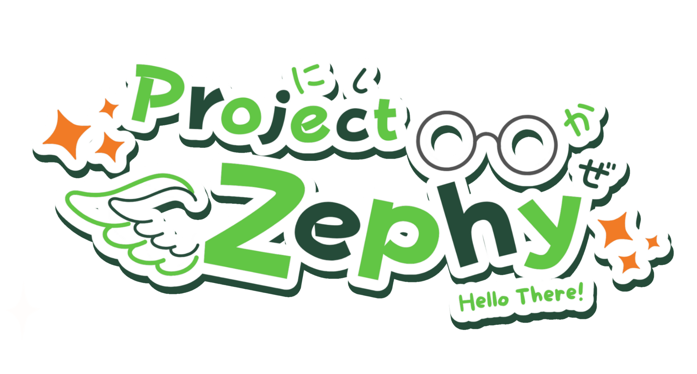
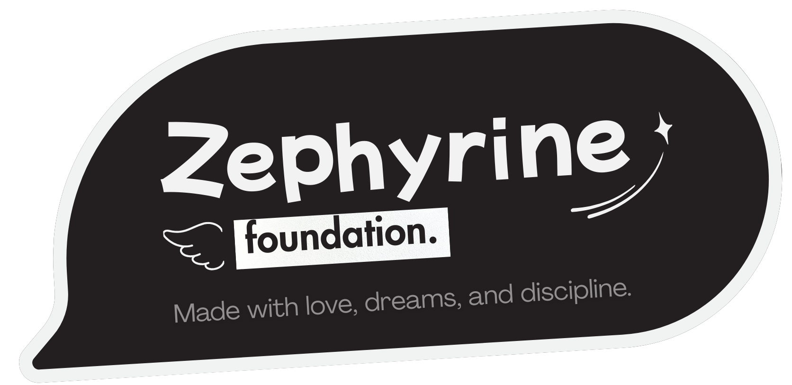

<h1 align="center">

<sub>

</sub>
<br>
</h1>

<h5 align="center"> </h5>


<h5 align="center">
<sub align="center">


</sub>
</h5>
<p align="center"><i>Hello there! I'm Adelaide Zephyrine Charlotte, Fascinating and a very nice moment to meet you, They usually called me Zephy. Hey are you ready to explore the aether with me?</i></p>

<p align="center"><h5>In Self-learning and Self-improvement We Trust</h5></p>
<hr>

[](https://firstdonoharm.dev/version/3/0/bds-bod-law-media-mil-soc-sup-sv.html)

## Adelaide Lite: The Lightweight version Core of Project Zephyrine

### A Glimpse Into the Aether: Abstract

Adelaide Lite is an more efficient iteration of Project Zephyrine's core architecture, Adelaide Lite distills the conversational and adaptive nature of Zephyrine into an engine designed for minimal storage footprint, lower runtime memory usage.

This is just another Adaptive Agent wrapper with determenistic response on certain question and query represents the integration of the **Stella-Icarus Deterministic Core** directly into the API routing layer. By utilizing an Elevated Level Privilege (ELP) priority thread scheduler and native OS tasking, we can ensure that deep cognitive reasoning (ELP0) never interrupts high-priority real-time responses on client response (ELP1), and finally ELP2 (StellaIcarus Determenistic API response)

### ⚙️ Core Architecture

Adelaide Lite is specifically tailored for environments with lower storage and constrained runtime memory capacity.

1.  **Ada/SPARK Foundation:** Inspired by some paradigms (Not really compliance completely but just inspired), specifically (DO-178C, ECSS-E-ST-40C, ECSS-Q-ST-80C). the entire networking, caching, and task-scheduling layer is written in Ada, providing structured guidance against buffer overflows, race conditions, and memory leaks.
2.  **WCET Enforcements:** The Worst-Case Execution Time (WCET) manager actively monitors and terminates non-deterministic AI generation if it breaches strict latency budgets, falling back to cached or deterministic responses. for ELP0 ELP1 ELP2 and ELP 3
3.  **Hybrid Deno Global Internet Reference Hooks:** Instead of embedding fragile web drivers, Adelaide Lite securely spawns isolated Deno/TypeScript subprocesses (`playwright_scraper.ts`) that utilize stealth-plugin techniques to breach bot-detection challenges and retrieve factual data for the generative core without compromising the stability of the Ada parent process.

### 🕊️ Volatus Damarae

The Ada-native orchestration layer of Adelaide Lite is codenamed **Volatus Damarae** — a deliberate departure from the Python-centric architecture of Project Zephyrine.

Where Zephyrine relies on Python for scheduling, embedding math, and inference routing, Volatus Damarae replaces those layers with native Ada tasking, the ELP priority queue, and Kratos crash isolation. This yields deterministic scheduling, sub-millisecond TTFB, and memory safety guarantees that a Python orchestrator cannot provide.

The ELP queue features four priority tiers:

| Level | Role | Description |
|-------|------|-------------|
| **ELP0** | Background | Deep cognitive reasoning, indexing, embedding — preemptible |
| **ELP1** | Foreground | Real-time inference, user-facing generation — high priority |
| **ELP2** | Deterministic | Stella-Icarus Deterministic API responses |
| **ELP3** | Light Task | Deterministic light task — 1ms fixed nanosecond WCET, Ravenscar profile |

All inference flows through a single serial queue (parallelism = 1) to prevent heap corruption from concurrent llama.cpp FFI calls on shared contexts.

### 🎭 API Interfaces

Adelaide Lite maintains compatibility with standard communication dialects to ease integration.

*   **The OpenAI Mask (`/v1/*`):** Full compatibility layer for `/v1/chat/completions` and `/v1/models`. Future implementations will expand this to full stateful Assistant APIs routed directly into the local SQLite memory graph.
*   **The Ollama Mask (`/api/*`):** Direct proxy and multiplexing for local inference endpoints (`/api/chat`, `/api/generate`), allowing Zephy to wrap and manage local models seamlessly.

### 🚀 Prerequisites and Quick Start

Adelaide Lite is designed to be highly portable but requires a specific set of tools to minimize bloat.

#### Requirements
*   **Alire (Ada LIbrary REpository):** Required to resolve Ada dependencies and build the core executable.
*   **Deno:** Required for running the stealth web-scraper sidecars. Deno ensures all JavaScript/TypeScript dependencies are sandboxed and natively cached without requiring a full Node.js installation.
*   **Python 3.10+:** Required as the primary orchestrator for complex embedding mathematical operations and SQLite Knowledge Graph interfacing.
*   **PyMuPDF (`fitz`):** For local document indexing and extraction.

#### Installation

1.  **Clone the Repository:**
    ```bash
    git clone https://github.com/albertstarfield/Adelaide_Lite
    cd Adelaide_Lite
    ```

2.  **Run the Initialization Script:**
    The `run.sh` script is designed to handle the Ada compilation, Deno setup, and repository cloning (such as `llama.cpp` and `supertonic`) automatically.
    ```bash
    ./run.sh
    ```

    *The script will automatically fetch Ada Web Server (AWS) packages via Alire, install the Deno Playwright Chromium binaries, and start the local API listener on port `11420`.*

## Warning
> A Warning to Adelaide Lite users newcomers
> 
> **(Please Read Carefully)**
> 
> This is a highly experimental platform combining efficient software paradigms with generative AI. It is **NOT** a plug-and-play ChatGPT nor an Agents clone. The system expects you to actively monitor CPU bounds, configure ELP priority schedulers, and manage the SQLite knowledge graph.
>
> If you are expecting a system that follows the expectation and status quo of AI in general, This is not it. **Look somewhere else. You have been warned.**

## Development Note
> 1. For AWS API /v1/completion OpenAI API and Ollama API I/O use pragma profile Jorvik while Watchdog use Ravenscar seperate threading. We still use Ada 2012 SPARK 2014. Because I am goddamn outdated.
> 2. For development QC (Not release) we use gnatprove level=4 for detecting potential issues not level=0 nor level=2. to match the Indonesian minimum costumer & consumer responsiveness and reliance expectation.
> 3. For release builds we use gnatprove level=4 with Pragma profile ada 2012 SPARK 2014 and Pragma profile Jorvik for AWS API /v1/completion and Ollama API I/O. then test crosscompile with target Darwin XNU and Linux arm64 and Linux x86_64, with respective environment variables and toolchains. We exclude NT based system due to various of issue for now.


---
<h1 align="center">
<sub>

</sub>
<h5 align="center">
Made with Love, Dreams, and Disciplines.<br>
<br>Snail Works</h5> <br>
Zephyrine Foundation 2023-2026
</h5>
<br>
</h1>
