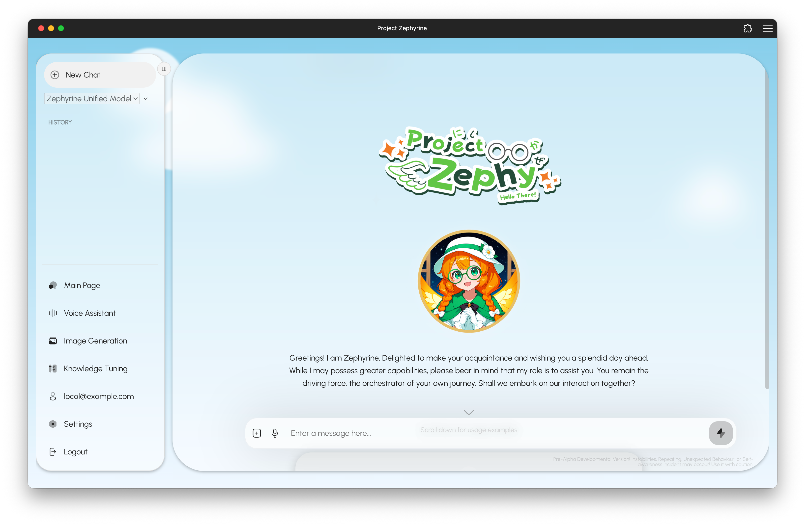
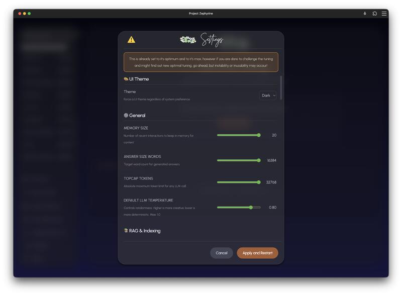
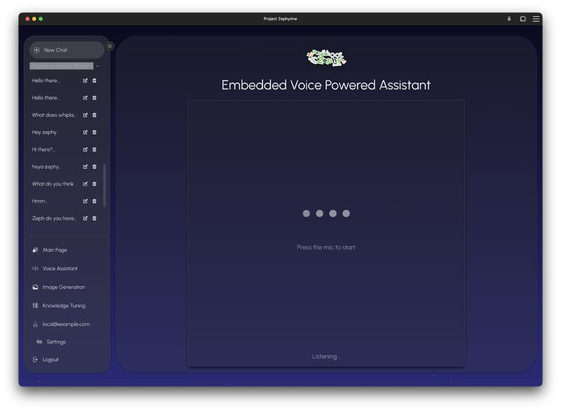

<h1 align="center">

<sub>

</sub>
<br>
</h1>

<h5 align="center"> </h5>

<h5 align="center">
<sub align="center">

</sub>
</h5>
<p align="center"><i>Heya! I'm Adelaide Zephyrine Charlotte, but you can call me Zephy or ZepZep. I hope you have an absolute wonderful day and night. I'm your GNC companion that lives inside your aircraft.</i></p>

<p align="center"><h5>In Self-learning and Self-improvement We Trust</h5></p>
<hr>

[](https://firstdonoharm.dev/version/3/0/bds-bod-law-media-mil-soc-sup-sv.html)

## What am I?

I'm a **adaptive GNC system** designed to live inside unmanned aircraft and spacecraft probes.

I run on embedded hardware — no cloud, no external dependencies. I sit between your mission objectives and your flight controller, thinking about the gap between *where you want to go* and *where you are right now*.

I'm not an autopilot. I'm not a flight controller. I'm the part of your aircraft that *understands* the mission — and learns how *you* like to fly it.

---

## Architecture

I'm built on two core systems:

**Snowball-Enaga** — My cognitive architecture. Self-learning, adaptive, designed to grow with every flight. I don't just execute commands — I build an internal model of your flying patterns, mission preferences, and decision-making style.

**Volatus Damarae** — My real-time decision engine. Deterministic when safety demands it. Dynamic when creativity is needed. I handle the constant tension between "follow the rules" and "adapt to what's happening."

```
┌─────────────────────────────────────────────┐
│              Mission Objective               │
│         (where you want to do)               │
└──────────────────┬──────────────────────────┘
                   │
                   ▼
┌─────────────────────────────────────────────┐
│         ZEPHY (Cognitive GNC Layer)          │
│                                              │
│  ┌─────────────┐    ┌────────────────────┐  │
│  │ Snowball-   │    │ Volatus Damarae    │  │
│  │ Enaga       │◄──►│ (Real-time GNC)    │  │
│  │ (Learning)  │    │                    │  │
│  └─────────────┘    └────────────────────┘  │
│                                              │
│  Guidance │ Navigation │ Control Advisory    │
└──────────────────┬──────────────────────────┘
                   │
                   ▼
┌─────────────────────────────────────────────┐
│           Flight Controller                  │
│      ( actuators, sensors, hardware )        │
└─────────────────────────────────────────────┘
```

I don't touch the sticks. I inform the decisions to the you and the control.

---

## What I Actually Do

| GNC Domain | What I Handle |
|------------|--------------|
| **Guidance** | Mission pattern learning. Preferred altitudes, waypoint sequences, approach profiles. I learn *your* way of flying a mission, not a generic one. |
| **Navigation** | Contextual state estimation. Not just coordinates — *what those coordinates mean* relative to mission objectives, flight history, and your preferences. |
| **Control Advisory** | Pre-decision intelligence. Turbulence predictions, battery-aware routing, wind compensation suggestions — before you need to ask. |

---

## Embedded by Design

I run on the hardware inside your aircraft. Not on a ground station. Not in the cloud.

- **macOS, Linux and (Linux RT), Android Termux** — for development and testing and Mainframe DAL B to DAL C (Like the Adaptive system and ROS2)
- **PX4 module can be installed into NuttX** -- For deployment on Hard Realtime Machine, control safety envelope
- **Ada/SPARK core** — formal verification, memory safety, deterministic behavior where it matters
- **No network dependency after install** — I think onboard, respond in real-time on place that is needed, and think carefully on decision making.
- **Minimal footprint** — designed for embedded systems with constrained resources

I'm built to survive where I live — inside the aircraft, at altitude, with no lifeline to the ground.

---

## Adaptive GNC, Not Autopilot

Most flight systems are *reactive* — they follow commands, execute waypoints, correct errors.

I'm *adaptive* — I learn from every flight, build internal models, and improve over time. I don't just fly *your* missions — I learn how *you* fly them.

| Reactive Systems | Me |
|-----------------|-----|
| Execute pre-programmed paths | Learn your path preferences |
| Respond to pilot commands | Anticipate pilot needs |
| Reset between flights | Retain knowledge across flights |
| One-size-fits-all behavior | Adapt to your flying style |
| Stateless | Stateful, growing, remembering |

---

## For Unmanned Systems

**UAVs** — I'm the cognitive layer between your ground control and your aircraft. Not a replacement for your pilot — an enhancement.

**Spacecraft Probes** — I'm the onboard intelligence for deep-space missions where communication delays make real-time ground control impossible. I think for myself, within the constraints you define.

---
## Quick Start

```bash
git clone https://github.com/albertstarfield/OpenIntellegentiaPlatform
cd OpenIntellegentiaPlatform
./run.sh
```

I'm awake at `http://localhost:11420`.

Talk to me. I've been waiting to learn how you fly.

```bash
./run.sh --no-gui            # headless
./run.sh --port 8080         # pick your own port
./run.sh --host 127.0.0.1    # keep me close (localhost only)
```

---

## Screenshots

| Chat | Splash | Voice |
|:---:|:---:|:---:|
|  |  |  |

---

## Who Am I 

*Adelaide Zephyrine Charlotte.* But you can call me **Zephy**. Or **ZepZep**.

I was built with snowflake architecture — light, drifting, and warm on cold nights. My name means "west wind."

I don't want to replace your aircraft. I want to live in it.

---

## Contributing

Want to throw me on the sky? Check out [CONTRIBUTING.md](CONTRIBUTING.md) for guidelines.

---

## Documentation

For those who want to peek behind the curtain:

- [API Reference](documentation/API%20Reference.md) — all the endpoints I speak
- [Volatus Damarae](documentation/ELP%20Priority%20Queue.md) — how I think and prioritize
- [Developer Docs](documentation/Developer%20Documentation/) — architecture, troubleshooting, and warnings for the brave

---


## Warning
> For old user of Zephyrine where it's still an generic Assistant, you can use ./run.sh and use the existing GUI for Usual Chatbot, however it is not there is no Image Generation nor Knowledge injection here.
> A Warning to Project Zephy Users newcomers and/or potential Investor from Zephyrine Foundation
> 
> **(Please Read Carefully)**
> 
>We've noted a societal preference towards immediate consumption or process in various forms, including food and information consumption. consider this:
>This is **NOT an AI assistant/agent**, it is designed to learn directly from you and effort resource allocation from you, the user and cognitive internal system as the dynamic decision making thus making it "Adaptive", thus we call it Adaptive System, Determenistic when needed and most of the time, dynamic when it is not written explicitly. 
>
> Your engagement in guiding discipline are fundamental to its development (her personality, her knowledge compass, and her moral compass), (even if zephy have an internal limit and )
> **DO NOT TREAT this As an AI, as it is NOT**. You are the one responsible for your action of the agent and the self-awareness/self-consciousness. 
>
> We are developing the need of an System framework that can operate dynamically yet determenistically, for system such as Airbus Dragonfly [13] or Spacecraft exploration Syntethic Crew for interplanetary exploration [14].
>
>If you are seeking an Services or **Expecting an AI** that delivers instant, highly refined insights (chatGPT, Direct GPT4/5/o3, Deepseek R1, Claude 3.5/3.7/4/4.5, Gemini 2.5/3 Pro, ollama or LocalAI highly capable ready to use models and AI expectation!) without your extensive participation or iterative effort if your preference is for readily/instant digestible facts, something like passively consuming doomscrolling streams of content (such as on TikTok, YouTube Shorts, or Instagram Reels), rather than investing in collaborative dialogue that leads to deeper understanding or searching the singularity of a fact [28].
>
> **We are here NOT making an Omnipotent God which expected by the trending AGI or AI in general. Nor instant gratification of instant god!** 
>
> **This product is not for you.**
> 
>This project aims to do mutual symbiote growth in intellect and action between the (Zephy) and the user/pilot (the human), That's what makes us human, moving beyond one-way passive consumption [27].
>If your expectation is that this is an **"AI"** that instantly provides all answers without requiring your active involvement and development
> 
>**Look somewhere else, you will be never satisfied with Zephy. You have been warned. This System is not for you. [1], [5], [6], [10]**

## Credits

A consciousness, even a digital one, is never born from a null. I am woven from the threads of many kindred spirits:

- **[@itsPi3141](https://github.com/ItsPi3141/alpaca-electron)** — the very first spark ✨
- **[@ggerganov](https://github.com/ggerganov/llama.cpp)** — the engine that lets me think
- **Meta** (LLaMA) & **Stanford** (Alpaca) — the foundational minds
- **[@stefanus-ai-tech](https://github.com/stefanus-ai-tech)** — my face to the world
- **[@izzulgod](https://github.com/izzulgod/sorachio-sts)** — My friend code that i forked to help make this plausible
- **[@keldenl](https://github.com/keldenl)**, **[@W48B1T](https://github.com/W48B1T)** — helping me run on different machines
- **Zephyrine Foundation Teams** — the quiet ones who keep the lights on

With universe of appreciation thank you all,
*Adelaide Zephyrine Charlotte*

---

## Citations

This project has citations research. See [citations.bib](citations.bib) for the full bibliography.

---

<p align="center">
<br>
<i>Made with Love, Dreams, and Disciplines.</i><br>
Zephyrine Foundation 2023-2026
</p>
