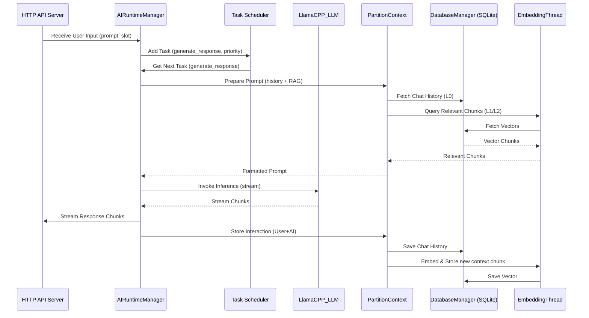

# Project Zephyrine Documentation

## 1. Overview

Project Zephyrine, personified by the AI assistant "Adelaide Zephyrine Charlotte," is an ambitious endeavor aimed at creating a sophisticated, locally-run conversational AI experience. Inspired by projects like Alpaca-Electron and Llama-GGML, it seeks to push the boundaries of local Large Language Model (LLM) interaction, with long-term goals potentially including deployment on embedded hardware.

The project has evolved significantly from its initial JavaScript/Electron roots, now featuring a complex, multi-component architecture centered around a powerful Python-based core engine. It incorporates advanced concepts like Retrieval-Augmented Generation (RAG), hardware awareness, and asynchronous task scheduling. The web interface components now utilize a local backend service for data persistence and LLM interaction, moving away from cloud dependencies for that part of the system.

## 2. Architecture

Project Zephyrine currently comprises several distinct components:

*   **Core Engine (`systemCore/engineMain`):** A Python application responsible for local LLM inference, context management, hardware interaction, RAG, and providing an OpenAI-compatible API. Uses its own SQLite database for history, vectors, etc. Aims to eventually serve its API on port `11434`.
*   **UI Backend Service (`systemCore/backend-service`):** A Node.js WebSocket server that acts as the **sole backend** for the Web Frontend. It handles:
    *   Connecting to LLM APIs (either cloud-based like Groq or a local OpenAI-compatible endpoint like the Core Engine or Ollama, configurable via `.env`).
    *   Managing chat sessions and message persistence using a local **SQLite** database (`database.db`).
    *   Streaming LLM responses back to the frontend via WebSockets.
    *   Handling chat history fetching, message saving/editing, and title generation requests from the frontend.
*   **Web Frontend (`systemCore/frontend-face-zephyrine`):** A React-based web application providing a modern chat interface. It interacts **exclusively** with the **UI Backend Service** via WebSockets (`ws://localhost:3001`) for *all* data operations (chat streaming, history, saving, editing) and uses a dummy local authentication state.
*   **Desktop UI (`systemCore/ZephyWebUI`):** An Electron application that appears to be a legacy component or a simplified interface. It currently uses a basic Flask backend stub for simulated interaction.

### High-Level Architecture Diagram

```mermaid
graph TD
    subgraph User Interfaces
        UI_Web[Web Frontend (React)]
        UI_Desktop[Desktop UI (Electron/Flask Stub)]
    end

    subgraph Backends
        B_Engine[Core Engine (Python/llama-cpp) <br> API Target: 11434]
        B_UIBackend[UI Backend Service (Node.js/WS)]
    end

    subgraph Data & Models
        DB_Engine[Engine DB (SQLite)]
        DB_UI[UI Backend DB (SQLite)]
        Models[Local Models (GGUF)]
        LLM_Cloud[Cloud LLM (Groq API)]
        LLM_LocalOllama[Separate Ollama <br> (e.g., 11435)]
    end

    UI_Web --> B_UIBackend;

    UI_Desktop --> B_Engine; %% Or potentially its own stub Flask backend

    B_UIBackend --> DB_UI;
    B_UIBackend --> LLM_Cloud;
    B_UIBackend -- Local Option 1 --> B_Engine;  %% Connect to Core Engine API
    B_UIBackend -- Local Option 2 --> LLM_LocalOllama; %% Connect to separate Ollama

    B_Engine --> Models;
    B_Engine --> DB_Engine;


    style B_Engine fill:#f9f,stroke:#333,stroke-width:2px
    style B_UIBackend fill:#ccf,stroke:#333,stroke-width:2px
```

### Core Engine (`engine.py`) Interaction Flow (Simplified)

*(This diagram remains unchanged as it describes the Python core engine)*



## 3. Core Components Detailed

### 3.1. Core Engine (`systemCore/engineMain/engine.py`)

*(This section remains largely unchanged, describing the Python engine)*

This is the heart of Project Zephyrine's local processing capabilities.

*   **Technology:** Python, asyncio, threading, llama-cpp-python, PyTorch, Tiktoken, Hugging Face Hub client, SQLite3, psutil, NumPy, scikit-learn.
*   **Key Features:**
    *   **Local LLM Inference:** Loads and runs GGUF-formatted LLMs using `llama-cpp-python`. Supports model management (downloading, conversion, quantization via `AIModelPreRuntimeManager`).
    *   **Hardware Awareness:** Detects CPU, RAM (incl. ECC), GPU (CUDA, ROCm, MPS, Vulkan), Disk, OS. Performs bandwidth tests and issues warnings based on suitability for ML tasks.
    *   **Asynchronous Task Scheduling:** Manages LLM inference, embedding, and other operations using prioritized queues (`mainProcessingIO`, `backbrainProcessingIO`, `meshNetworkProcessingIO`) via `asyncio`.
    *   **Retrieval-Augmented Generation (RAG):** Implements a sophisticated `PartitionContext` system (detailed further in the "Science Behind It" section) managing context memory. Uses `snowflake-arctic-embed.gguf` for embedding text chunks and stores/retrieves them from an SQLite vector store for context augmentation.
    *   **Branch Prediction:** An experimental feature (detailed in the "Science Behind It" section) attempting proactive response generation by predicting likely user inputs.
    *   **Persistence:** Uses SQLite (`DatabaseManager`) to store chat history, vector embeddings, task queues, and inference cache **for the Core Engine**.
    *   **API:** Provides an OpenAI-compatible HTTP server endpoint for interaction (Targeting `http://localhost:11434/v1`).
    *   **Persona:** Embeds instructions defining the AI's ("Adelaide") personality and behavior.
    *   **Utilities:** Includes GGUF parsing, output formatting, prompt templating, JSON repair, and system monitoring.

### 3.2. UI Backend Service (`systemCore/backend-service/server.js`)

This component serves as the dedicated backend for the Web Frontend.

*   **Technology:** Node.js, Express, ws (WebSockets), Groq SDK, OpenAI SDK, `sqlite3`.
*   **Key Features:**
    *   **WebSocket API:** Provides the primary interface for the Web Frontend, handling messages for chat operations, history requests, edits, etc.
    *   **LLM Broker:** Connects to either the Groq cloud API or a local OpenAI-compatible API (e.g., the Core Engine on `11434` or Ollama on a different port), configured via `.env` (`GROQ_API_KEY`, `LOCAL_LLM_API_ENDPOINT`). Forwards chat requests and streams responses.
    *   **Local Database:** Uses **SQLite** (`database.db` file within its directory) for storing chat history, messages, and metadata (like titles) specifically for the Web UI interactions.
    *   **Chat Management:** Handles fetching chat history, saving user/assistant messages, updating messages on edits, and deleting chats based on WebSocket commands.
    *   **Title Generation:** Automatically generates chat titles using the configured LLM based on the first user message.
*   **Role:** Acts as the sole intermediary between the React Web Frontend and the necessary backend resources (LLM APIs and its own SQLite database), ensuring the frontend itself remains simpler and doesn't handle persistence or direct LLM calls.

### 3.3. Web Frontend (`systemCore/frontend-face-zephyrine/`)

A modern web interface for interacting with the system via the UI Backend Service.

*   **Technology:** React, Vite, React Router, CSS, custom hooks.
*   **Key Features:**
    *   **Dummy Authentication:** Uses a simplified context (`AuthContext.jsx`) providing a static, dummy logged-in user state suitable for local development.
    *   **Chat Interface:** Provides a standard chat layout with a sidebar (history) and a main chat area.
    *   **Rich Content:** Renders Markdown in chat messages.
    *   **State Management:** Uses custom React hooks extensively (e.g., `useChatHistory`, `useSystemInfo`).
    *   **Backend Connection:** Connects **only** to the **UI Backend Service** (`systemCore/backend-service`) via WebSocket (default `ws://localhost:3001`) for **all** real-time functionality, including chat streaming, fetching history, saving/editing messages, and receiving title updates. Uses `import.meta.env.VITE_WEBSOCKET_URL` if set.

### 3.4. Desktop UI (`systemCore/ZephyWebUI/`)

*(This section remains unchanged)*

An Electron-based desktop application.

*   **Technology:** Electron, Node.js, Vanilla JS, Flask (Python), marked, katex, winston.
*   **Key Features:**
    *   Provides a native desktop experience.
    *   Displays system statistics and chat interface.
    *   Includes extensive settings options configurable via the UI.
    *   Renders Markdown and LaTeX.
*   **Current State:** Appears to be partially functional or legacy. The Python backend (`app.py`) only simulates responses. The Electron main process (`index.js`) and `package.json` contain remnants of more complex, self-contained LLM/NLP features that seem disabled or removed. It likely represents an earlier architectural iteration of the project.

## 4. Science Behind It

*(This section remains largely unchanged, focusing on the Core Engine concepts)*

Project Zephyrine leverages several key concepts from AI and computer science:
*(... keep existing points like LLMs, GGUF, Embeddings, RAG, Async, Context Window, Hardware Accel, Prompt Eng, Decision Trees, Ada ...)*
*(Review points like Memory Consistency, ECC Memory, Other Warnings - these relate to the Core Engine's hardware awareness)*

## 5. Future Goals

*(This section remains unchanged)*

Based on the codebase and documentation:
*(... keep existing points like Embedded, Reasoning, Multi-Modal, UI/UX, Cloud/Local Hybrid ...)*

## 6. Contributing & Development

This section details the setup process, focusing on the **unified launch script** for development and the separate build process for the **Core Engine**.

### 6.1. Unified Development Launch (`launch.py`)

This is the **primary method** for running the development environment, including the Web UI and its backend.

*   **Prerequisites:**
    *   Python 3 (Tested with 3.12/3.13 recommended)
    *   Git
    *   Node.js and npm
    *   `pip install colorama` (for colored console output)
    *   **(Optional but Recommended for full functionality):** C/C++ Build Toolchain (needed if `launch.py` is configured to also start the `engineMain` component, which requires compiled C++ backends):
        *   **Linux:** `build-essential` (Debian/Ubuntu), `gcc-c++` (Fedora/CentOS), `base-devel` (Arch), etc.
        *   **macOS:** Xcode Command Line Tools (`xcode-select --install`)
        *   **Windows:** Visual Studio Build Tools (Can be installed via Chocolatey)
    *   **(Optional but Recommended for full functionality):** CMake (needed for C++ builds)

*   **Setup & Launch Steps:**
    1.  Clone the repository (if not already done).
    2.  Navigate to the **project root directory** (the one containing `launch.py` and the `systemCore` folder).
    3.  **Run the launcher script:**
        ```bash
        # Replace python3 with python3.12 or your specific version if needed
        python3 launch.py
        ```
    4.  **What `launch.py` Does:**
        *   Checks if running inside the project's Python virtual environment (`./venv`). If not, it creates `./venv` (if missing) using the system's Python 3 and re-launches itself using the venv's Python.
        *   Once in the venv, it installs/updates Python dependencies from `systemCore/engineMain/requirements.txt`.
        *   Installs/updates Node.js dependencies for the UI Backend Service (`systemCore/backend-service/package.json`).
        *   Installs/updates Node.js dependencies for the Web Frontend (`systemCore/frontend-face-zephyrine/package.json`).
        *   Starts the **Core Engine** (`systemCore/engineMain/app.py`) in a separate thread. *(Note: You might configure `launch.py` to make this optional if only developing the UI)*.
        *   Starts the **UI Backend Service** (`systemCore/backend-service/server.js`) in a separate thread.
        *   Starts the **Web Frontend** (`systemCore/frontend-face-zephyrine`) development server (Vite) in a separate thread.
        *   Displays interleaved, timestamped, and color-coded logs from all running services in the console.
        *   Handles graceful shutdown of all started services when you press `Ctrl+C`.

*   **Configuration (`.env` file in project root):**
    *   `GROQ_API_KEY`: Your API key if you want the UI Backend Service to use Groq.
    *   `LOCAL_LLM_API_ENDPOINT`: The URL for an OpenAI-compatible API that the **UI Backend Service** (`systemCore/backend-service`) should connect to when `GROQ_API_KEY` is **not** set.
        *   **Long-Term Goal:** This should eventually point to Project Zephyrine's **Core Engine** (`systemCore/engineMain`), which aims to provide its own OpenAI-compatible API, potentially running on `http://localhost:11434/v1`.
        *   **Development/Fallback:** If the Core Engine's API is not yet running or fully functional on port `11434`, you can use this variable to point the UI Backend Service to a *separate* instance of a local LLM server like Ollama.
        *   **Port Conflict Note:** If you intend to run the Zephyrine Core Engine (targeting port `11434`) **and** a separate Ollama instance simultaneously during development, you **must configure Ollama to run on a different port** (e.g., by setting `OLLAMA_HOST=127.0.0.1:11435` before starting Ollama). In that case, you would set `LOCAL_LLM_API_ENDPOINT=http://localhost:11435/v1` in the `.env` file for `launch.py`.
        *   If this variable is not set in `.env`, the UI Backend Service defaults to `http://localhost:11434/v1`, assuming *something* (either the Core Engine or Ollama) is providing the API there.
    *   *(Other variables previously used by Supabase or the Core Engine might still be present but are not used by the UI Backend Service or Web Frontend anymore)*
    *   **Note:** The UI Backend Service (`server.js`) uses SQLite (`database.db`) by default, this is not configured via `.env`.
    *   **Note:** The Web Frontend (Vite) looks for `.env` files within its own directory (`systemCore/frontend-face-zephyrine/`) for variables prefixed with `VITE_`. E.g., `VITE_WEBSOCKET_URL` can override the default `ws://localhost:3001`.

### 6.2. Core Engine Build Process (`launchcontrol/run.sh`)

This script handles the complex build process specifically for the Python **Core Engine** and its C++ dependencies. It's typically run once for initial setup or when updating the C++ backends. The `launch.py` script assumes these builds have been completed successfully if it intends to run the Core Engine.

*   **Prerequisites:** Requires the C/C++ Build Toolchain and CMake mentioned above. GPU acceleration prerequisites (CUDA Toolkit etc.) are needed here if you want GPU support compiled in.
*   **Running the Build:**
    1.  Navigate to the project root directory.
    2.  Execute the script: `bash launchcontrol/run.sh`
*   **What it Does:** (See previous documentation version for the detailed steps involving `coreRuntimeManagement.py`: system dependency installs, cloning submodules, CMake builds for `llama.cpp`, `gemma.cpp`, `gnat-llvm`, etc.) This prepares the necessary executables and libraries used by `systemCore/engineMain/engine.py`.

### 6.3. Production Builds

*   **Web Frontend:**
    1.  Navigate to `systemCore/frontend-face-zephyrine`.
    2.  Run `npm run build`. The output will be in the `dist` directory. Serve these static files alongside the UI Backend Service.
*   **UI Backend Service:** This is a Node.js application. Deploy it using standard Node.js methods (e.g., `node server.js` via PM2, Docker, etc.). Ensure the `database.db` SQLite file is included or created in its working directory.
*   **Core Engine:** Deploy the Python application (`engine.py`) along with its dependencies (installed in `venv`) and the compiled C++ backends (from the `systemCore/vendor/.../build` directories). Requires a compatible Python environment on the target machine.

*(End of Updated Documentation)*