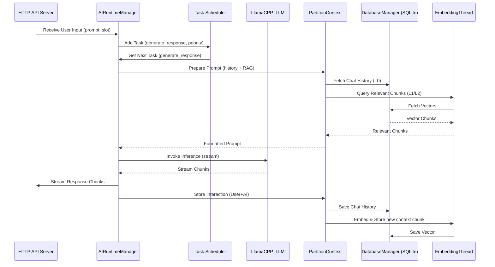

# Project Zephyrine Documentation

## 1. Overview

Project Zephyrine, personified by the AI assistant "Adelaide Zephyrine Charlotte," is an ambitious endeavor aimed at creating a sophisticated, locally-run conversational AI experience. Inspired by projects like Alpaca-Electron and Llama-GGML, it seeks to push the boundaries of local Large Language Model (LLM) interaction, with long-term goals potentially including deployment on embedded hardware.

The project has evolved significantly from its initial JavaScript/Electron roots, now featuring a complex, multi-component architecture centered around a powerful Python-based core engine. It incorporates advanced concepts like Retrieval-Augmented Generation (RAG), hardware awareness, and asynchronous task scheduling.

## 2. Architecture

Project Zephyrine currently comprises several distinct components, suggesting different deployment strategies or stages of development:

*   **Core Engine (`systemCore/engineMain`):** A Python application responsible for local LLM inference, context management, hardware interaction, and providing an OpenAI-compatible API.
*   **Backend Service (`systemCore/backend-service`):** A Node.js WebSocket server that utilizes cloud services (Groq API for LLM inference, Supabase for database) for chat functionality.
*   **Web Frontend (`systemCore/project-zephyrine-web`):** A React-based web application providing a modern chat interface, likely interacting with either the Core Engine API or the Backend Service WebSocket/Supabase.
*   **Desktop UI (`systemCore/ZephyWebUI`):** An Electron application that appears to be a legacy component or a simplified interface. It currently uses a basic Flask backend stub for simulated interaction.

### High-Level Architecture Diagram

```mermaid
graph TD
    subgraph User Interfaces
        UI_Web[Web Frontend (React)]
        UI_Desktop[Desktop UI (Electron/Flask Stub)]
    end

    subgraph Backend Options
        B_Local[Core Engine (Python/llama-cpp)]
        B_Cloud[Backend Service (Node.js/Groq/Supabase)]
    end

    subgraph Data & Models
        DB_Local[Local DB (SQLite)]
        DB_Cloud[Cloud DB (Supabase)]
        Models[Local Models (GGUF)]
        Cloud_LLM[Cloud LLM (Groq API)]
    end

    UI_Web --> B_Cloud;
    UI_Web --> DB_Cloud;
    UI_Web -- Potentially --> B_Local;

    UI_Desktop --> B_Local; %% Or potentially its own stub Flask backend

    B_Local --> Models;
    B_Local --> DB_Local;

    B_Cloud --> Cloud_LLM;
    B_Cloud --> DB_Cloud;

    style B_Local fill:#f9f,stroke:#333,stroke-width:2px
    style B_Cloud fill:#ccf,stroke:#333,stroke-width:2px
```

### Core Engine (`engine.py`) Interaction Flow (Simplified)



## 3. Core Components Detailed

### 3.1. Core Engine (`systemCore/engineMain/engine.py`)

This is the heart of Project Zephyrine's local processing capabilities.

*   **Technology:** Python, asyncio, threading, llama-cpp-python, PyTorch, Tiktoken, Hugging Face Hub client, SQLite3, psutil, NumPy, scikit-learn.
*   **Key Features:**
    *   **Local LLM Inference:** Loads and runs GGUF-formatted LLMs using `llama-cpp-python`. Supports model management (downloading, conversion, quantization via `AIModelPreRuntimeManager`).
    *   **Hardware Awareness:** Detects CPU, RAM (incl. ECC), GPU (CUDA, ROCm, MPS, Vulkan), Disk, OS. Performs bandwidth tests and issues warnings based on suitability for ML tasks.
    *   **Asynchronous Task Scheduling:** Manages LLM inference, embedding, and other operations using prioritized queues (`mainProcessingIO`, `backbrainProcessingIO`, `meshNetworkProcessingIO`) via `asyncio`.
    *   **Retrieval-Augmented Generation (RAG):** Implements a `PartitionContext` system managing short-term (L0) and long-term (L1/L2) memory. Uses `snowflake-arctic-embed.gguf` for embedding text chunks and stores/retrieves them from an SQLite vector store for context augmentation.
    *   **Branch Prediction:** A unique feature attempting to predict conversation flow using LLM-generated decision trees.
    *   **Persistence:** Uses SQLite (`DatabaseManager`) to store chat history, vector embeddings, task queues, and inference cache.
    *   **API:** Provides an OpenAI-compatible HTTP server endpoint for interaction.
    *   **Persona:** Embeds instructions defining the AI's ("Adelaide") personality and behavior.
    *   **Utilities:** Includes GGUF parsing, output formatting, prompt templating, JSON repair, and system monitoring.

### 3.2. Backend Service (`systemCore/backend-service/server.js`)

This component provides an alternative, cloud-based backend.

*   **Technology:** Node.js, Express, ws (WebSockets), Groq SDK, Supabase client.
*   **Key Features:**
    *   **WebSocket API:** Provides the primary interface for clients.
    *   **Cloud LLM:** Forwards chat requests to the Groq API for inference.
    *   **Cloud Database:** Uses Supabase for storing chat metadata (e.g., titles).
    *   **Title Generation:** Automatically generates chat titles using Groq based on the first user message.
*   **Role:** Its existence alongside the local Core Engine suggests it might be for:
    *   A cloud-deployment target.
    *   A fallback mechanism.
    *   Handling specific clients or features that benefit from cloud infrastructure (e.g., potentially faster inference via Groq, easier data synchronization via Supabase).

### 3.3. Web Frontend (`systemCore/project-zephyrine-web/`)

A modern web interface for interacting with the system.

*   **Technology:** React, Vite, React Router, Supabase client, CSS, custom hooks.
*   **Key Features:**
    *   **User Authentication:** Manages user login/sessions via Supabase Auth.
    *   **Chat Interface:** Provides a standard chat layout with a sidebar (history, model selection, settings) and a main chat area.
    *   **Rich Content:** Renders Markdown in chat messages.
    *   **State Management:** Uses custom React hooks extensively.
    *   **Backend Agnostic (Potentially):** Likely connects to either the Core Engine's HTTP API or the Backend Service's WebSocket API, possibly determined by configuration or runtime detection.

### 3.4. Desktop UI (`systemCore/ZephyWebUI/`)

An Electron-based desktop application.

*   **Technology:** Electron, Node.js, Vanilla JS, Flask (Python), marked, katex, winston.
*   **Key Features:**
    *   Provides a native desktop experience.
    *   Displays system statistics and chat interface.
    *   Includes extensive settings options configurable via the UI.
    *   Renders Markdown and LaTeX.
*   **Current State:** Appears to be partially functional or legacy. The Python backend (`app.py`) only simulates responses. The Electron main process (`index.js`) and `package.json` contain remnants of more complex, self-contained LLM/NLP features that seem disabled or removed. It likely represents an earlier architectural iteration of the project.

## 4. Science Behind It

Project Zephyrine leverages several key concepts from AI and computer science:

*   **Large Language Models (LLMs):** At its core, the project uses LLMs (specifically models compatible with `llama.cpp` in GGUF format) to understand and generate human-like text.
*   **GGUF & Quantization:** Utilizes the GGUF format for efficient model distribution and loading. Implements quantization techniques (e.g., Q4_K_M) to reduce model size and computational requirements, making them feasible to run on consumer hardware, albeit with a potential trade-off in precision.
*   **Embeddings & Vector Stores:** Employs text embeddings (using models like `snowflake-arctic-embed`) to convert text into numerical vectors. These vectors are stored in a database (SQLite in the core engine) allowing for efficient similarity searches.
*   **Retrieval-Augmented Generation (RAG):** Combines the generative power of the LLM with information retrieved from the vector store. When generating a response, relevant context (past conversation snippets, documents) is fetched based on the current query's embedding and added to the LLM's prompt, enhancing factual accuracy and long-term memory. The `PartitionContext` class manages this process.
*   **Asynchronous Processing & Task Scheduling:** Uses Python's `asyncio` and `threading` to handle multiple tasks concurrently (LLM inference, embedding, API requests) without blocking the main application flow, improving responsiveness. A scheduler prioritizes tasks.
*   **Context Window Management:** Addresses the limited context window of LLMs by using the RAG approach and potentially other summarization or selection techniques within `PartitionContext` to provide the most relevant information within the token limit.
*   **Hardware Acceleration & Awareness:** The core engine actively checks system hardware (CPU architecture, RAM/VRAM bandwidth, ECC memory, available accelerators like CUDA, ROCm, MPS) and provides warnings. This reflects an understanding that ML performance is heavily dependent on underlying hardware capabilities and aims to guide users towards optimal configurations or manage expectations.
*   **Prompt Engineering:** The base64 encoded instructions in `engine.py` and the specific prompts used (e.g., for title generation in `backend-service`) demonstrate deliberate prompt engineering to guide the LLM's behavior and output format.
*   **Decision Trees (Branch Predictor):** The experimental "branch predictor" feature attempts to use the LLM to generate structured decision trees, potentially exploring techniques like Chain-of-Thought or Tree-of-Thoughts for more complex reasoning or planning.

## 5. Future Goals

Based on the codebase and documentation:

*   **Embedded Systems:** The backstory explicitly mentions the goal of implementing the assistant on embedded hardware. This aligns with the focus on local execution, quantization, and hardware awareness.
*   **Enhanced Reasoning:** Features like the "Branch Predictor" and "BackBrain Queue" suggest ongoing work towards more complex reasoning, planning, and background processing capabilities.
*   **Multi-Modal Capabilities:** The presence of `Llava` model conversion code in `engine.py` hints at potential future integration of vision capabilities.
*   **Improved UI/UX:** The existence of multiple UI components (Web, Desktop) suggests ongoing efforts to refine the user experience.
*   **Cloud/Local Hybrid:** The parallel existence of the local Core Engine and the cloud-based Backend Service might indicate a future hybrid approach, allowing users to choose or switch between local privacy/control and cloud scalability/performance.

## 6. Contributing & Development

*(Placeholder: This section would typically include guidelines for setting up the development environment, running tests, coding standards, and contribution process. Currently inferred from `package.json` scripts and `run.sh`)*

*   **Installation:** Likely involves Python and Node.js setup. The root `run.sh` or specific `package.json` scripts (`npm start`, `npm run dev`) are entry points.
*   **Dependencies:** Managed via `pip` (implied for Python) and `npm`.
*   **Building:** `package.json` files contain scripts for building the Electron app (`electron-packager`, `electron-builder`) and the React app (`vite build`).

*(End of Draft)*